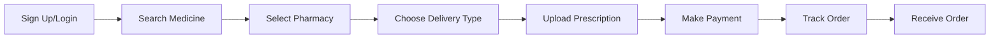
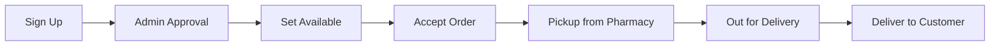

<div align="center">

# 💊 Swasthya Sarathi - Pharmacy E-Commerce Platform

### A Modern Multi-Role Pharmacy Delivery System

[](https://reactjs.org/)
[](https://vitejs.dev/)
[](https://redux-toolkit.js.org/)
[](https://tailwindcss.com/)
[](LICENSE)

**Swasthya Sarathi** is a comprehensive pharmacy e-commerce platform with real-time order tracking, location-based medicine search, and integrated payment gateway. Built with modern web technologies to provide seamless experiences for customers, pharmacy vendors, delivery volunteers, and administrators.

[Demo](#) · [Backend Repository](https://github.com/bairariyakhushal/Swasthya-Sarthi) · [Report Bug](../../issues) · [Request Feature](../../issues)

</div>

---

## ✨ Key Features

<table>
<tr>
<td>

### 🛒 For Customers
- 🔍 **Location-Based Search** - Find medicines within 5km radius
- 🏪 **Multiple Pharmacies** - Compare prices and availability
- 🚚 **Flexible Delivery** - Home delivery or store pickup
- 💳 **Secure Payments** - Razorpay integration with verification
- 📋 **Prescription Upload** - Easy document submission
- 📍 **Real-Time Tracking** - Track orders with timeline view
- 📱 **Order Management** - View order history and details

</td>
<td>

### 🏥 For Vendors
- 📦 **Inventory Management** - Add and update medicines with profit margins
- 📊 **Sales Dashboard** - Track sales, revenue, and net profit
- 🏪 **Pharmacy-Specific Dashboards** - Individual pharmacy performance metrics
- 🔔 **Order Notifications** - Real-time order alerts
- ✅ **Order Processing** - Confirm, prepare, and fulfill orders
- 🧾 **Prescription Verification** - Approve/reject prescriptions
- 📈 **Advanced Analytics** - Total orders, completed orders, medicines sold
- 🔍 **Inventory Search** - Quick search and filter capabilities

</td>
</tr>
<tr>
<td>

### 🚴 For Volunteers
- 📋 **Available Orders** - View nearby delivery requests
- 🗺️ **Live Location** - Update GPS coordinates in real-time
- ✔️ **Accept/Reject Orders** - Choose deliveries to fulfill
- 🔄 **Status Updates** - Mark pickup, in-transit, delivered
- 📜 **Delivery History** - Track completed deliveries
- 🟢 **Availability Toggle** - Set online/offline status

</td>
<td>

### 👨‍💼 For Admins
- ✅ **Approval System** - Verify pharmacy and volunteer registrations
- 👥 **User Management** - Manage all user roles
- 📊 **Platform Analytics** - Monitor platform performance
- 🏪 **Pharmacy Verification** - Review and approve pharmacies
- 🚚 **Volunteer Verification** - Validate delivery partners
- 📈 **Dashboard Overview** - Complete platform insights

</td>
</tr>
</table>

---

## 🚀 Tech Stack

<table>
<tr>
<td align="center" width="96">

<br>React 18
</td>
<td align="center" width="96">

<br>Vite
</td>
<td align="center" width="96">

<br>Redux Toolkit
</td>
<td align="center" width="96">

<br>Tailwind CSS
</td>
<td align="center" width="96">

<br>JavaScript
</td>
</tr>
</table>

### Core Technologies
- ⚛️ **React 18.3.1** - Modern UI library with hooks
- ⚡ **Vite 5.4.2** - Lightning-fast build tool
- 🔄 **Redux Toolkit** - State management with slices & async thunks
- 🎨 **Tailwind CSS 3.4.1** - Utility-first CSS framework
- 🌐 **React Router DOM** - Client-side routing
- 📡 **Axios** - HTTP client with interceptors
- 💰 **Razorpay** - Payment gateway integration
- 🔥 **React Hot Toast** - Beautiful notifications
- 🎭 **React Icons** - Comprehensive icon library
- 🎬 **Framer Motion** - Smooth animations and transitions

## 📁 Project Structure

```
src/
├── api/                    # API layer
│   ├── axiosInstance.js
│   ├── authApi.js
│   ├── customerApi.js
│   ├── vendorApi.js
│   ├── volunteerApi.js
│   └── adminApi.js
│
├── redux/                  # Redux store & slices
│   ├── store.js
│   └── slices/
│       ├── authSlice.js
│       ├── customerSlice.js
│       ├── vendorSlice.js
│       ├── volunteerSlice.js
│       └── adminSlice.js
│
├── components/             # Reusable components
│   ├── common/
│   │   └── Loader.jsx
│   ├── ui/
│   │   ├── Button.jsx
│   │   ├── Input.jsx
│   │   ├── Card.jsx
│   │   └── ProductCard.jsx
│   └── layouts/
│       ├── Layout.jsx
│       ├── Navbar.jsx
│       └── Footer.jsx
│
├── pages/                  # Page components
│   ├── Auth/
│   ├── Customer/
│   ├── Vendor/
│   ├── Volunteer/
│   └── Admin/
│
├── router/                 # Routing
│   ├── ProtectedRoute.jsx
│   ├── RoleBasedRoute.jsx
│   └── AppRoutes.jsx
│
├── utils/                  # Utility functions
│   ├── location.js
│   ├── validation.js
│   ├── formatters.js
│   ├── razorpay.js
│   └── constants.js
│
├── App.jsx
├── main.jsx
└── index.css
```

## �🚀 Quick Start

### Prerequisites

Before you begin, ensure you have the following installed:
- **Node.js** (v18.0 or higher)
- **npm** or **yarn** package manager
- **Backend API** running - [Backend Repository](https://github.com/bairariyakhushal/Swasthya-Sarthi)

### Installation

1️⃣ **Clone the repository**
```bash
git clone https://github.com/nilesh-rahangdale/Swasthya-Sarathi
cd Swasthya-Sarathi
```

2️⃣ **Install dependencies**
```bash
npm install
# or
yarn install
```

3️⃣ **Configure environment variables**

Create a `.env` file in the root directory:

```env
# API Endpoints
VITE_API_BASE_AUTH=http://localhost:4000/api/v1/auth
VITE_API_BASE_ADMIN=http://localhost:4000/api/v1/admin
VITE_API_BASE_VENDOR=http://localhost:4000/api/v1/vendor
VITE_API_BASE_CUSTOMER=http://localhost:4000/api/v1/customer
VITE_API_BASE_VOLUNTEER=http://localhost:4000/api/v1/volunteer
VITE_API_BASE_PHARMACY=http://localhost:4000/api/v1/pharmacy
VITE_API_BASE_ORDER=http://localhost:4000/api/v1/order

# Payment Gateway
VITE_RAZORPAY_KEY_ID=your_razorpay_key_id

```

4️⃣ **Start development server**
```bash
npm run dev
# or
yarn dev
```

The application will be available at **http://localhost:5173**

5️⃣ **Build for production**
```bash
npm run build
# or
yarn build
```

6️⃣ **Preview production build**
```bash
npm run preview
# or
yarn preview
```

---

## 🚀 Deployment

### Deploying to Vercel

1️⃣ **Install Vercel CLI** (if not already installed)
```bash
npm install -g vercel
```

2️⃣ **Login to Vercel**
```bash
vercel login
```

3️⃣ **Deploy**
```bash
vercel --prod
```

### Deploying to Netlify

1️⃣ **Build the project**
```bash
npm run build
```

2️⃣ **Deploy dist folder**
- Drag and drop the `dist` folder to Netlify
- Or use Netlify CLI:
```bash
npm install -g netlify-cli
netlify deploy --prod --dir=dist
```

### Environment Variables for Production
Make sure to set all environment variables in your hosting platform:
- `VITE_API_BASE_*` - All API endpoints
- `VITE_RAZORPAY_KEY_ID` - Razorpay key
- `VITE_GOOGLE_MAPS_API_KEY` - Google Maps key (optional)

---

## 🎯 Key Technical Features

### 🏗️ Architecture Highlights
- **Redux Toolkit State Management** - Centralized state with async thunks for API calls
- **Role-Based Routing** - Protected routes with automatic role validation
- **Lazy Loading** - Code splitting for optimal performance
- **Error Boundaries** - Graceful error handling with fallback UI
- **Custom Hooks** - Reusable logic for location, cart, and authentication

### 🎨 UI/UX Excellence
- **Framer Motion Animations** - Entrance, exit, and hover animations
- **Responsive Design** - Works seamlessly on desktop, tablet, and mobile
- **Gradient Effects** - Modern multi-color gradients throughout
- **Micro-interactions** - Button hover effects, scale animations
- **Loading States** - Skeleton screens and animated loaders
- **Toast Notifications** - Real-time feedback for user actions

### 🔐 Security & Performance
- **JWT Token Management** - Secure authentication with automatic refresh
- **Input Validation** - Client-side form validation
- **Protected API Routes** - Axios interceptors for token injection
- **Optimized Bundles** - Vite's build optimization and tree shaking
- **Image Lazy Loading** - On-demand image loading
- **Debounced Search** - Optimized search performance

---

## 🎯 Application Workflow

### Customer Journey


### Vendor Journey


### Volunteer Journey


---

## 🔐 Authentication & Security

### Authentication Flow
```
1. User Registration → OTP Verification → Role Selection
2. JWT Token Generation → Secure Storage (localStorage)
3. Token Validation → Role-Based Access Control
4. Protected Routes → Automatic Redirection
```

### Security Features
- 🔒 **JWT Authentication** - Secure token-based auth
- 🛡️ **Role-Based Access Control** - Granular permissions
- 🔑 **OTP Verification** - Email-based verification
- 🚫 **Protected Routes** - Unauthorized access prevention
- 🔄 **Token Refresh** - Automatic session management
- 📝 **Input Validation** - Client-side form validation

---

## 🌍 Location-Based Features

### Geolocation Search
- 📍 **Browser Geolocation API** - Get user's current location
- 🎯 **Radius-Based Search** - 5km default search radius
- 📏 **Distance Calculation** - Haversine formula for accuracy
- 📊 **Sorted Results** - Nearest pharmacies first
- 🗺️ **Real-Time Updates** - Live volunteer location tracking

---

## 💳 Payment Integration

### Razorpay Payment Flow

```
1. Customer selects medicines → Create Order
2. Backend generates Razorpay Order ID
3. Frontend opens Razorpay Checkout Modal
4. Customer completes payment
5. Payment verification (razorpay_payment_id, razorpay_order_id, razorpay_signature)
6. Backend validates payment signature
7. Order confirmed → Track Order
```

### Payment Features
- 💰 **Multiple Payment Methods** - Cards, UPI, Wallets, Net Banking
- 🔐 **Secure Transactions** - PCI DSS compliant
- ✅ **Payment Verification** - Server-side signature validation
- 📱 **Mobile Optimized** - Responsive payment UI
- 🔄 **Payment Status Tracking** - Real-time status updates

---

## 📦 API Integration

All API calls use Axios with:
- Automatic token injection
- Error handling
- Request/response interceptors
- Toast notifications

## 🎨 UI Components

### Reusable Components
- **Button**: Multiple variants (primary, secondary, success, danger, outline, ghost)
- **Input**: With icons, validation, error states
- **Card**: Hover effects, multiple padding sizes
- **ProductCard**: Modern e-commerce style with gradient effects, animations
- **Loader**: Full screen or inline
- **Layout**: Navbar + Footer wrapper

### Styling
- **Tailwind CSS** for all styling
- Custom color palette with gradient effects
- Responsive design (mobile-first)
- Smooth transitions and animations
- Modern glassmorphism effects

## 🏗️ Architecture & Best Practices

### Code Quality
✅ **Component-Based Architecture** - Modular and reusable components  
✅ **Redux Toolkit** - Centralized state management  
✅ **Async Thunks** - Efficient async operations  
✅ **Protected Routes** - Role-based access control  
✅ **Custom Hooks** - Reusable logic extraction  
✅ **Error Boundaries** - Graceful error handling  
✅ **Code Splitting** - Lazy loading for performance  

### Development Standards
✅ **ESLint** - Code linting and formatting  
✅ **Consistent Naming** - camelCase for functions, PascalCase for components  
✅ **Clean Architecture** - Separation of concerns  
✅ **Utility Functions** - DRY principle  
✅ **Component Documentation** - Clear prop types and usage  
✅ **Modular Design** - Reusable and composable components  
✅ **Git Workflow** - Feature branches and pull requests  

### Performance Optimization
⚡ **Lazy Loading** - Route-based code splitting with React.lazy  
⚡ **Memoization** - React.memo for expensive components  
⚡ **Debouncing** - Search input optimization  
⚡ **Image Optimization** - Lazy loading with fallback icons  
⚡ **Bundle Optimization** - Tree shaking and minification  
⚡ **Efficient Re-renders** - Proper dependency arrays in hooks  
⚡ **Framer Motion** - Hardware-accelerated animations  

---

## 📝 Available Scripts

| Command | Description |
|---------|-------------|
| `npm run dev` | Start development server with hot reload |
| `npm run build` | Create optimized production build |
| `npm run preview` | Preview production build locally |
| `npm run lint` | Run ESLint for code quality |

---

## 🔗 API Integration

### Authentication Endpoints
| Method | Endpoint | Description |
|--------|----------|-------------|
| POST | `/api/v1/auth/login` | User login |
| POST | `/api/v1/auth/signup` | User registration |
| POST | `/api/v1/auth/sendotp` | Send OTP for verification |
| POST | `/api/v1/auth/changepassword` | Change user password |

### Customer Endpoints
| Method | Endpoint | Description |
|--------|----------|-------------|
| GET | `/api/v1/pharmacy/search` | Search medicines by location |
| GET | `/api/v1/pharmacy/{id}/inventory` | Get pharmacy inventory |
| POST | `/api/v1/order/create-payment-order` | Create Razorpay order |
| POST | `/api/v1/order/verify-payment` | Verify payment signature |
| POST | `/api/v1/order/{id}/upload-prescription` | Upload prescription |
| GET | `/api/v1/customer/my-orders` | Get customer orders |
| GET | `/api/v1/order/track/{orderId}` | Track order status |

### Vendor Endpoints
| Method | Endpoint | Description |
|--------|----------|-------------|
| POST | `/api/v1/pharmacy/register` | Register pharmacy |
| POST | `/api/v1/pharmacy/inventory/{pharmacyId}` | Add inventory |
| GET | `/api/v1/vendor/pharmacy/{id}/dashboard` | Pharmacy dashboard |
| GET | `/api/v1/vendor/pharmacy/{id}/orders` | Get pharmacy orders |
| PUT | `/api/v1/pharmacy/order/{orderId}/confirm` | Confirm order |
| PUT | `/api/v1/pharmacy/order/{orderId}/ready-for-pickup` | Mark ready |
| PUT | `/api/v1/pharmacy/order/{orderId}/complete-pickup` | Complete pickup |
| POST | `/api/v1/pharmacy/order/{orderId}/verify-prescription` | Verify prescription |

### Volunteer Endpoints
| Method | Endpoint | Description |
|--------|----------|-------------|
| GET | `/api/v1/volunteer/available-orders` | Get available orders |
| GET | `/api/v1/volunteer/my-deliveries` | Get assigned deliveries |
| PUT | `/api/v1/volunteer/location` | Update GPS location |
| PUT | `/api/v1/volunteer/availability` | Toggle availability |
| PUT | `/api/v1/volunteer/order/{orderId}/accept` | Accept order |
| PUT | `/api/v1/volunteer/order/{orderId}/status` | Update order status |

### Admin Endpoints
| Method | Endpoint | Description |
|--------|----------|-------------|
| GET | `/api/v1/admin/dashboard` | Admin dashboard stats |
| GET | `/api/v1/admin/pharmacies/pending` | Pending pharmacies |
| GET | `/api/v1/admin/volunteers/pending` | Pending volunteers |
| PUT | `/api/v1/admin/pharmacies/{id}/approval` | Approve/reject pharmacy |
| PUT | `/api/v1/admin/volunteers/{id}/approval` | Approve/reject volunteer |

---

## 🎨 UI/UX Highlights

### Design System
- 🎨 **Modern Gradient Designs** - Beautiful multi-color gradients (blue → indigo → purple)
- 📱 **Responsive Layout** - Mobile-first approach with breakpoints
- 🌙 **Consistent Theme** - Unified color palette across all modules
- ✨ **Smooth Animations** - Framer Motion for entrance and hover effects
- 🔔 **Toast Notifications** - User-friendly feedback with React Hot Toast
- ⚡ **Loading States** - Skeleton loaders and animated spinners
- 🎯 **Intuitive Navigation** - Clear user flows with breadcrumbs
- 🎭 **Micro-interactions** - Hover effects, scale animations, color transitions
- 💎 **Glassmorphism** - Modern frosted glass effects
- 🌈 **Color-Coded Status** - Visual indicators for order states

### Component Library
- **Button** - Multiple variants with gradient effects and hover animations
- **Input** - With icons, validation states, floating labels
- **Card** - Shadow effects, gradient borders, hover states
- **ProductCard** - E-commerce style with image zoom, badges, quantity controls
- **Modal** - Accessible overlays with backdrop blur
- **Loader** - Full-screen and inline variants with animations
- **Badge** - Status indicators with color coding and icons
- **StatCard** - Dashboard metrics with gradient backgrounds
- **Navbar** - Responsive with role-based menus
- **Footer** - Multi-section with links and social media

---

## 🤝 Contributing

Contributions are welcome! Please follow these steps:

1. Fork the repository
2. Create a feature branch (`git checkout -b feature/AmazingFeature`)
3. Commit your changes (`git commit -m 'Add some AmazingFeature'`)
4. Push to the branch (`git push origin feature/AmazingFeature`)
5. Open a Pull Request

### Contribution Guidelines
- Follow existing code style and conventions
- Write meaningful commit messages
- Add comments for complex logic
- Test your changes thoroughly
- Update documentation if needed

---

## 🗺️ Roadmap

### Completed ✅
- [x] Multi-role authentication system
- [x] Location-based medicine search
- [x] Payment gateway integration (Razorpay)
- [x] Real-time order tracking
- [x] Responsive design with modern UI
- [x] Pharmacy-specific dashboards
- [x] Inventory management with profit tracking
- [x] Admin approval workflows
- [x] Volunteer delivery system

### In Progress 🚧
- [ ] Add dark mode support
- [ ] Implement PWA features (offline support, push notifications)
- [ ] Enhanced search filters (category, manufacturer)

### Future Enhancements 🚀
- [ ] Add multilingual support (Hindi, regional languages)
- [ ] Integrate video consultation with doctors
- [ ] Add medicine reminder notifications
- [ ] Implement chat support for customer service
- [ ] Add advanced analytics dashboard with charts
- [ ] Integrate AI-based medicine recommendations
- [ ] Add medicine alternatives suggestions
- [ ] Implement subscription-based medicine delivery
- [ ] Add health tracking and medication history
- [ ] Integration with health insurance providers

---

<div align="center">

### 🌟 Star this repository if you find it helpful!

**Built with ❤️ using React + Vite + Redux Toolkit + Tailwind CSS**

[⬆ Back to Top](#-swasthya-sarathi---pharmacy-e-commerce-platform)

</div>
